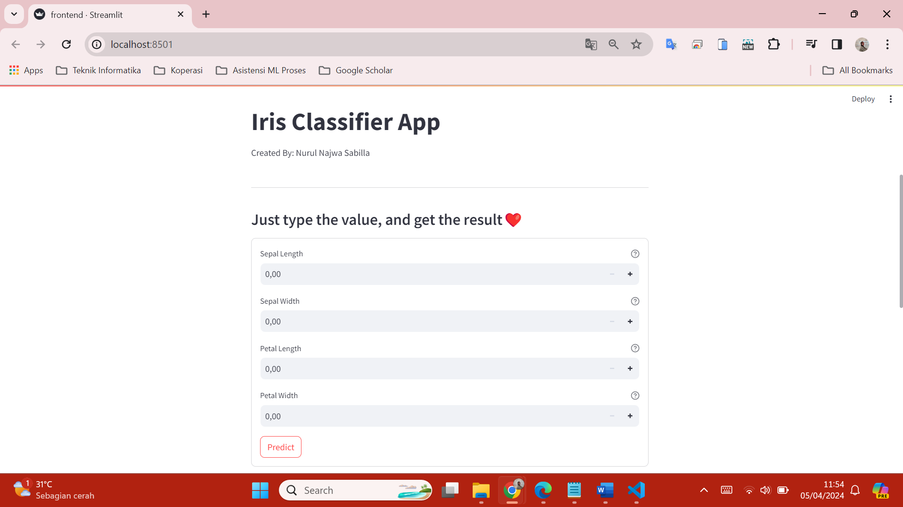

## Iris Flower Classification

Mempelajari dengan model machine learning yang sudah siap untuk kemudian, dibangun frontend dan backend untuk antarmuka pengguna, di mana frontend menerima input, mengirimnya ke backend, dan menampilkan hasil prediksi. Backend menggunakan model ML untuk prediksi, sementara frontend menangani tampilan dan interaksi. Dengan demikian, aplikasi dapat memprediksi bunga iris secara interaktif melalui proses machine learning.

